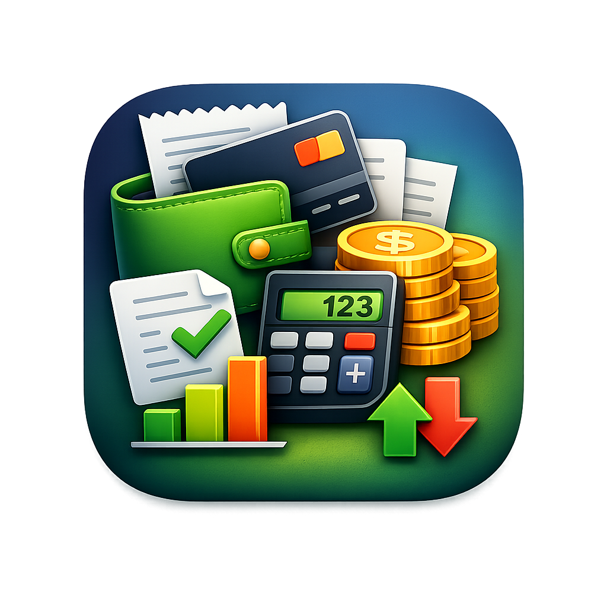

<div align="center">
  
  <h1>SubDebt Manager</h1>
  <p><strong>A privacy-focused, offline-first application for tracking subscriptions, daily spending, and personal debts.</strong></p>

  [](https://reactnative.dev/)
  [](https://expo.dev/)
  [](https://www.typescriptlang.org/)
  [](https://opensource.org/licenses/MIT)
  
  <br />
  
  ### 📥 Direct Downloads (v1.2.0)
  <a href="https://github.com/n4itr0-07/SubDebt-Manager/releases/download/v1.2.0/SubDebt-universal.apk"></a>
  <a href="https://github.com/n4itr0-07/SubDebt-Manager/releases/download/v1.2.0/SubDebt-arm64-v8a.apk"></a>
  <a href="https://github.com/n4itr0-07/SubDebt-Manager/releases/download/v1.2.0/SubDebt-armeabi-v7a.apk"></a>
  <a href="https://github.com/n4itr0-07/SubDebt-Manager/releases/download/v1.2.0/SubDebt-x86_64.apk"></a>

</div>

---

<table align="center">
  <tr>
    <td align="center">
      
      <br />
      <i>Subscriptions</i>
    </td>
    <td align="center">
      
      <br />
      <i>Daily Spending</i>
    </td>
    <td align="center">
      
      <br />
      <i>Debts & Lent</i>
    </td>
    <td align="center">
      
      <br />
      <i>Quick Add Menu</i>
    </td>
    <td align="center">
      
      <br />
      <i>Settings</i>
    </td>
  </tr>
</table>

## Overview

SubDebt Manager is a fast, responsive mobile application designed to help you organize your daily finances. It brings together subscription tracking, personal debt management, and daily spending logs into one clean interface. Built entirely offline, the application ensures that your financial data stays securely on your device.

## Core Features

### Subscription Tracking
- **Automatic Branding:** Detects popular services and automatically assigns the correct brand icons.
- **Billing Cycles:** Tracks time remaining until the next billing cycle and categorizes subscriptions by their status (active, expiring soon, expired).

### Debt & Lent Management
- **Running Ledger:** Calculates your total pending capital across all people who owe you money, or people you owe.
- **Overdue Analytics:** Highlights overdue debts and calculates exactly how many days they are past due.
- **Resolution:** Quickly mark debts as paid with immediate feedback.

### Daily Spending
- **Streak Building:** Encourages daily logging by tracking your active entry streak.
- **Visual Charts:** Automatically generates a 7-day spending chart and categorizes your expenses.
- **Quick Entry:** Features a central quick-add menu to rapidly record purchases on the go.

### Privacy & Architecture
- **Offline First:** No telemetry, cloud servers, or remote databases. Data is sandboxed locally on your device.
- **Fast Storage:** Powered by memory-mapped files (MMKV) for instantaneous read and write speeds.
- **Data Portability:** Includes a complete JSON backup and restore system, allowing you to export your data and move it to a new device.
- **Dynamic Theming:** Features a custom UI system that fully supports both light and dark modes, adapting instantly to your system preferences.

## Installation & Setup

### Prerequisites
- Node.js (v18 or newer)
- Expo CLI
- iOS Simulator or Android Studio

### Quick Start

1. **Clone the repository:**
   ```bash
   git clone https://github.com/SubDebt-Manager/SubDebt-Manager.git
   cd SubDebt-Manager
   ```

2. **Install dependencies:**
   ```bash
   npm install --legacy-peer-deps
   ```

3. **Compile and Run:**
   Because SubDebt uses native C++ modules for local storage, it requires a development build rather than the standard Expo Go client.
   ```bash
   # For Android
   npx expo run:android

   # For iOS
   npx expo run:ios
   ```

## Automated Release Pipeline

This project includes an automated CI/CD pipeline via GitHub Actions. Whenever a new version tag (e.g., `v1.2.0`) is pushed, the system automatically builds an optimized `arm64-v8a` APK and attaches it to a new GitHub Release. 

You can find the latest compiled application in the **Releases** tab.

---
<div align="center">
  <i>Engineered for reliability. Built for privacy.</i>
</div>
